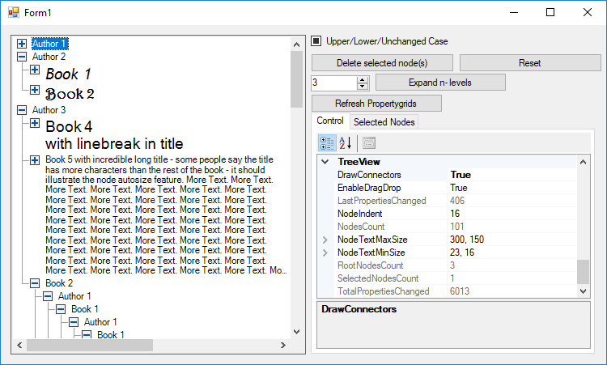

# BCF Examples
## Intro
My intension creating BCF was to have a reusable infrastructure for calculation optimized objectmodels supporting
transaction processing, undo & redo, validation and databinding.
## Treeview
A lazy loading treeview with individual node font, node autosize feature, horizontal + vertical scrolling and in tree drag & drop.
This example illustrates caching of computed values and recalculating only when neccessary. Expanding a node - or changing 
font size - will cause recalculation of below (only) nodes location.

<a href="TreeView/doc/README.md">Read mode about Treeview Example</a>
