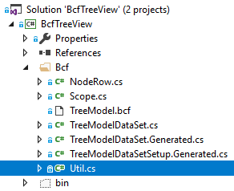
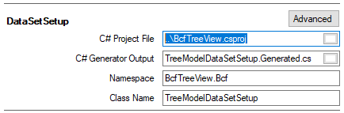

# Treeview Example
This example focus on calculation and simple transaction processing.

## Model
The treeview model has two areas. The internal and the public model. The internal model is a BCF-dataset used for
calculation and is generated by BCF Editor; the public objectmodel (API) grants access to some members from outside
and is written by hand.
### BCF Model
#### Tables
- `Controls`: A table dedicated to have always a single row representing the treeview control.
- `Nodes`: A table containing one row per (materialized) node.
#### Relations
- `ControlToAllNodes` **1:n** grants each node-row (child end) access to control-row (parent end) and vice versa. 
This relation has a `ParentNotNull`-constraint.
- `NodeToNextSiblings` **1:0-1** provides access from a node-row (child end) to its previous sibling (parent end)
and from a node-row (parent end) to next sibling**s** (child end). Since BCF has no built-in support for 1:0-1 relations it
is 1:n with `MaxChildRows`-constraint of 1.
- `NodeToChildNodes` **1:n** The link between parent and child node-rows
- `ControlToSelectedNodes` **1:n** used to maintain a list of selected nodes (from parent end control-row) and 
indicates a node is selected (child end node-row parent `!= null`)
- `ControlToRootNodes` **1:n** similar to previous relation but cares about root node-rows
#### Columns

| table  | column | type |default  | function |
| --- | --- | --- | --- |
Controls|NodeIndent|`int`|`16`
Controls|NodeTextMinSize|`Size`|`new Size(23, 16)`
Controls|NodeTextMaxSize|`Size`|`new Size(300, 150)`
Controls|Font|`Font`
Controls|StringFormat|`StringFormat`|`StringFormat.GenericDefault`
Controls|StringMeasureGraphics|`Graphics`
Controls|AutoScrollMinSize|`Size`|`default(Size)`|`right.Any() ? new Size(right.Max(), bottom.Max()) : Size.Empty`
|||||right:`+ControlToRootNodes*.ClientAreaRight`
|||||bottom:`+ControlToRootNodes*.ClientAreaBottom`
Controls|NodeObjectToString|`Func<object, string>`|`o => o?.ToString() ?? string.Empty`
Controls|TreeView|`TreeView`
|||||
Nodes|Level|`int`|`default(int)`|`parentNodeLevel.GetValueOrDefault(-1) + 1`
|||||parentNodeLevel: `-NodeToChildNodes*.Level`
Nodes|SiblingIndex|`int`|`default(int)`|`prevSiblingIndex.GetValueOrDefault(-1) + 1`
|||||prevSiblingIndex:`-NodeToNextSiblings*.SiblingIndex`
Nodes|Visible|`bool`|`default(bool)`|`parentVisible != false && parentExpanded != false`
|||||parentVisible:`-NodeToChildNodes*.Visible`
|||||parentExpanded:`-NodeToChildNodes*.Expanded`
Nodes|CanExpand|`bool`|`default(bool)`|`childProp.Any() || hasNonMaterializedChildren`
|||||childProp:`+NodeToChildNodes*.NodeObject`
|||||hasNonMaterializedChildren:`HasNonMaterializedChildren`
Nodes|Expanded|`bool`|`default(bool)`|
Nodes|ChildNodesInitialized|`bool`|`default(bool)`|
Nodes|HasNonMaterializedChildren|`bool`|`default(bool)`|
Nodes|NodeObject|`object`||
Nodes|Text|`string`|`string.Empty|toString?.Invoke(obj) ?? string.Empty`
|||||toString:`-ControlToAllNodes*.NodeObjectToString`
|||||obj:`NodeObject`
Nodes|Size|`Size`|`default(Size)`|`Util.NodeSize(sf, f, g, text, minSize, maxSize)`
|||||sf:`-ControlToAllNodes*.StringFormat`
|||||f:`Font`
|||||g:`-ControlToAllNodes*.StringMeasureGraphics`
|||||text:`Text`
|||||minSize:`-ControlToAllNodes*.NodeTextMinSize`
|||||maxSize:`-ControlToAllNodes*.NodeTextMaxSize`
Nodes|Top|`int`|`default(int)`|`prevSiblingChildBottom ?? parentNodeBottom ?? 0`
|||||prevSiblingChildBottom:`-NodeToNextSiblings*.ClientAreaBottom`
|||||parentNodeBottom:`-NodeToChildNodes*.Bottom`
Nodes|Left|`int`|`default(int)`|`level * indent + 23`
|||||level:`Level`
|||||indent:`-ControlToAllNodes*.NodeIndent`
Nodes|Bottom|`int`|`default(int)`|`visible ? (top + size.Height) : 0`
|||||visible:`Visible`
|||||top:`Top`
|||||size:`Size`
Nodes|Right|`int`|`default(int)`|`visible ? (left + size.Width) : 0`
|||||visible:`Visible`
|||||left:`Left`
|||||size:`Size`
Nodes|ClientAreaBottom|`int`|`default(int)`|`childBottoms.Concat(new []{ bottom }).Max()`
|||||childBottoms:`+NodeToChildNodes*.ClientAreaBottom`
|||||bottom:`Bottom`
Nodes|ClientAreaRight|`int`|`default(int)`|`childRight.Concat(new []{ right }).Max()`
|||||childRight:`+NodeToChildNodes*.ClientAreaRight`
|||||right:`Right`
Nodes|Font|`Font`||`fontSet ?? controlFont`
|||||fontSet:`FontSet`
|||||controlFont:`-ControlToAllNodes*.Font`
Nodes|FontSet|`Font`||

Classes generated by BCF Editor are `partial`. So we added some helpers to "NodeRow.cs" and
"TreeModelDataSet.cs".

##### Functions
Functions are written in c#. You can use custom function including them in the referenced project
using BCF Editor. For example **Nodes.Size: `Util.NodeSize(sf, f, g, text, minSize, maxSize)`**

Solution explorer:



Code file "Util.cs":
```
namespace BcfTreeView.Bcf
{
    internal static class Util
    {

        public static Size NodeSize(StringFormat sf, Font f, Graphics g, string text, Size minSize, Size maxSize)
        {
            var size = Size.Ceiling(g.MeasureString(text, f, maxSize, sf));
            size += new Size(2, 2); // focus
            return new Size(Math.Max(size.Width, minSize.Width) + 2, Math.Max(size.Height, minSize.Height));
        }
    }
}
```

BCF Editor - Project page:

 

*Don't forget to add namespace to BCF Editor!*

##### Parameters
There are three ways BCF can provide parameter values.

- Linking parameter along relations and access cell(s). The main benefit is that changes on linked cells
will cause automatic recalculation of depending cells. Examples: 
  - **`Nodes.Font`** parameter `fontSet`: `FontSet`. The parameter `fontSet`
will be initialized with same rows value of `FontSet`-column.
  - **`Nodes.Font`** parameter `controlFont`: `-ControlToAllNodes*.Font`. The parameter `controlFont`
will be initialized like: 
    - `-`: take parent (`+` would mean take children) of
    - `ControlToAllNodes` relation
    - `*` use all related rows (`%` would mean distinct rows only)
    - `.` step separator
    - `Font` select its value of column `Font`
    - since walking a relation from child to parent, parameter type equals type of target column
    - when accessing parent columns of not nullable types, the parameter type should be nullable
(see: **Nodes.Level** root nodes parent node is `null`)
  - **`Nodes.ClientAreaBottom`** parameter `childBottoms`: `+NodeToChildNodes*.ClientAreaBottom`
    - walking relations from parent to child results in an `IEnumerable<target column type>`
- Setting a default value using BCF Editor. The parameter may be updated at runtime like:
```
-- Changing a parameter value this way will not cause recalculation.
column.Function.FindParameter<int>(parameterName).Value = 10
```
- Setting a parameter `func<BcfFunction, BcfRow, TParameter>`. For Example:
```
(fn, row)=>r.Table.DataSet.GetHashCode()
```
##### Triggers
###### Nodes.Font
The column is computed and so it has to be read only. Triggers can be used to work around this limitation
by intercepting and redirecting value set. The trigger:
```
(cell, value, updateCurrent) => cell.OwningRow.SetValueObject("FontSet", value)
```
The Function:
```
fontSet ?? controlFont
```
So setting a value will cause the function returns the value set. Except when setting `null` function
will return the (general) control-row `Font` value.
###### Nodes.Expanded
This trigger contains the lazy load magic: Materialize child nodes when expanding the first time.
The trigger:
```
Util.NodeExpandedTrigger
```

codefile:
```
namespace BcfTreeView.Bcf
{
    internal static class Util
    {

        public static readonly BcfTrigger<bool> NodeExpandedTrigger = new BcfTrigger<bool>((cell, value, update) =>
        {
            var nodeRow = (NodeRow)cell.OwningRow;
            if (!nodeRow.Expanded && !nodeRow.ChildNodesInitialized && nodeRow.HasNonMaterializedChildren)
            {
                nodeRow.ChildNodesInitialized = true;
                var childObjects = nodeRow.ControlRow.TreeView.GetChildNodeObjectsInternal(nodeRow.Node);
                nodeRow.Table.DataSet.CurrentTransaction.SetEnforceConstraints(false);
                foreach (var childObject in childObjects)
                {
                    var childRow = nodeRow.Table.AddNewRow();
                    childRow.NodeObject = childObject;
                    childRow.HasNonMaterializedChildren = nodeRow.ControlRow.TreeView.GetChildNodeObjectsInternal(childRow.Node).Any();
                    childRow.SetAs(NodeTargetMode.LastChild, nodeRow);
                }
                nodeRow.HasNonMaterializedChildren = false;
            }
            update(); // necessary to write through - NodeExpanded is not computed
        });
    }
}
```
### Public Model (API)
#### TreeView
The TreeView inherits `UserControl` and contains the typical code for mouse and keyboard interaction and some properties.
#### Node
Privides public access to some useful properties and methods.
## Simple Transaction Processing
Each and every data update on a `BcfDataSet` is encapsulated in a transaction. When updating a cells `Value` property
without a transaction, a transaction will be created, update will be performed and the transaction will be committed - or
in case of error the transaction will be rolled back and an exception will be thrown.

A feature of `BcfTransaction` is to defer calculation. Instead on recomputing all dependent cells immediately we
can "collect" many updates and perform outstanding calculations on transaction committ. 

Transaction also allow to defer
constraint checks. To cause a transaction to defer constraint checks set parameter `enforceConstraints` to `false` or
set default on `dataSet.TransactionFactory.EnforceConstraints = false` and omit `enforceConstraints` parameter
when creating the transaction. In our example relation `ControlToAllNodes` has a `ParentNotNull`-constraint. 
Adding a node-row without a transaction with defered constraint-checks will cause a relation-constraint-exception 
since parent control-row is not set (yet). 

Many methods requires a transaction. But explict transaction requires many code lines and would lead to complex
looking helper methods:
```
var transaction = model.BeginTransation(enforceConstraints: false);
doSomething1(model);
doSomething2(model);
try
{
    transaction.Commit();
}
catch(Exception)
{
    transaction.Rollback();
    // handle or throw
    throw;
}
```

What about this:
```
using(model.GetScope())
{
    doSomething1(model);
    doSomething2(model);
}
```

To get this working we need a disposable `Scope` class:
```
namespace BcfTreeView.Bcf
{
    internal sealed class Scope : IDisposable
    {
        [NotNull]
        private readonly BcfTransaction _transaction;

        [CanBeNull]
        private readonly Action<Exception> _onError;

        internal Scope([NotNull]BcfTransaction transaction, Action<Exception> onError = null)
        {
            _transaction = transaction;
            _onError = onError;
        }

        public void Dispose()
        {
            try
            {
                _transaction.Commit();
            }
            catch (Exception ex)
            {
                // ReSharper disable once PossibleNullReferenceException
                _transaction.Rollback();
                _onError?.Invoke(ex);
            }
        }
    }
}
```
A method creating the `Scope` instance:
```
namespace BcfTreeView.Bcf
{
    internal static class Util
    {
        [CanBeNull]
        public static Scope GetScope([NotNull] this BcfDataSet model, Action<Exception> onError = null)
        {
            if (model == null) throw new ArgumentNullException(nameof(model));
            if (onError != null || model.CurrentTransaction?.EnforceConstraints != false) return new Scope(model.BeginTransaction(enforceConstraints: false), onError);
            return null;
        }
    }
}
```
And use it:
```
        public void MoveNodes([NotNull] IEnumerable<Node> nodes, [NotNull] Node target, NodeTargetMode mode, Action<Exception> onError)
        {
            if (nodes == null) throw new ArgumentNullException(nameof(nodes));
            if (target == null) throw new ArgumentNullException(nameof(target));
            if (!target.IsValid) throw new ArgumentException("specified target is invalid", nameof(target));
            if (target.NodeRow.ControlRow != _model.ControlRow) throw new ArgumentException("specified target is not in tree", nameof(target));
            using (_model.GetScope(onError))
            {
                foreach (var node in nodes)
                {
                    node.NodeRow.Unlink();
                    node.NodeRow.SetAs(mode, target.NodeRow);
                }
            };
        }

        private void ShowError(Exception ex)
        {
            if (ex is BcfCalculationException) MessageBox.Show("The operation makes a node its own parent or sibling", "Operation undone");
            else MessageBox.Show(ex.ToString(), ex.GetType().Name);
        }
```


